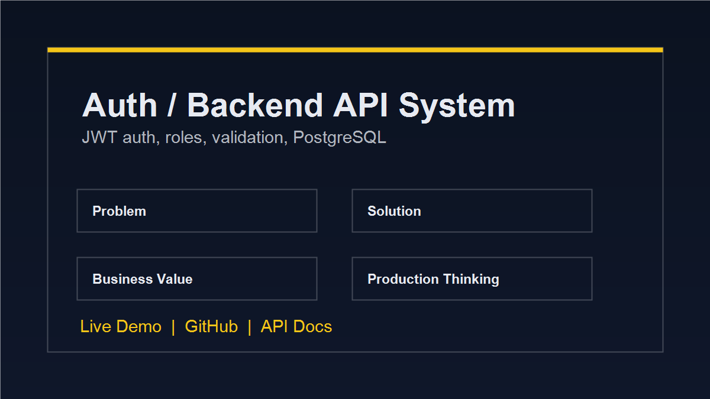
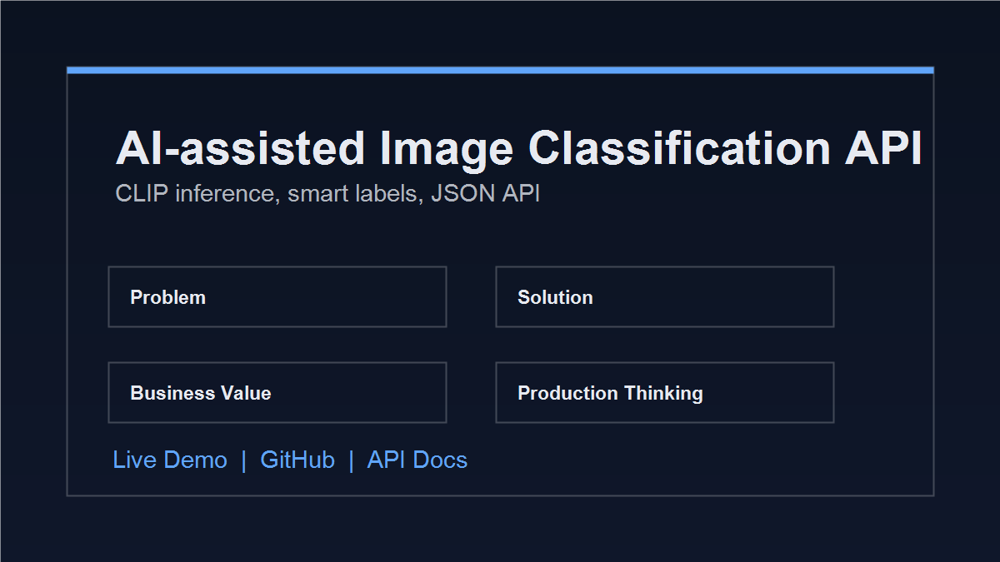
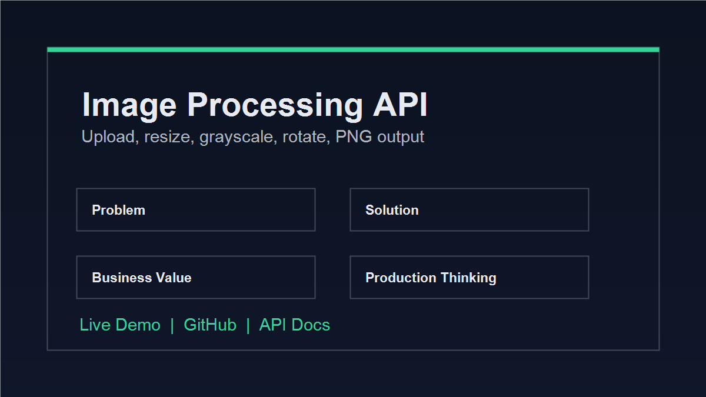

# Software Developer Portfolio | Backend, AI Automation & Research-led Digital Products

Portfolio site and backend demo platform presenting practical backend systems, AI automation, API integrations, and research-led digital product work.

The portfolio follows a problem-first approach: understand the workflow and underlying need, validate the direction, design a reliable technical path, and present the result through clear case studies and working demonstrations.

## Live Links

- Portfolio: https://kamilsarbian.dev
- API docs: https://api.kamilsarbian.dev/docs
- GitHub: https://github.com/kamilSarbian/Portfolio

## Problem

Most portfolio projects present technologies before the value they create. This project is structured around backend problems that appear in real internal tools: secure access, API communication, repetitive manual work, file processing, and clear data flow between services.

## Solution

The application combines a React frontend with a FastAPI backend and exposes several working backend workflows:

- authentication and role-based access
- image classification with CLIP-based inference
- image processing through API upload flows
- contact workflow with backend validation and email delivery
- optional AI-assisted technical direction for contact inquiries
- a private AI automation environment documented as the JARVIS case study
- a research-led digital product discovery case study for Living Startpakke
- API documentation through Swagger

The frontend presents the work as focused case studies instead of a long list of disconnected demos.

## Business Value

- Reusable backend foundation for dashboards, admin panels, and internal tools.
- API workflows that reduce manual file handling and make processing repeatable.
- Clear technical documentation that helps recruiters and engineers inspect the system quickly.
- Production-minded details such as validation, role checks, JWT configuration, error handling, and test coverage.

## Architecture

```text
React + Vite frontend (Vercel)
        |
        | HTTPS / JSON / file uploads
        v
FastAPI backend API (Render)
        |
        | SQLAlchemy
        v
PostgreSQL database

AI-assisted inquiry workflow:

Contact form
        |
        | Optional ask_ai_direction=true
        v
FastAPI backend API
        |
        | Bearer-authenticated HTTPS request
        v
Isolated JARVIS API microservice (Hetzner VPS)
        |
        | Cloudflare Tunnel / no exposed VPS ports
        v
DeepSeek API

External services:
- SMTP provider for contact form email delivery
- OpenCLIP/PyTorch for image classification
- Have I Been Pwned API for the password breach experiment
- DeepSeek API for AI-assisted inquiry direction
```

The AI layer is fallback-safe: only the inquiry message is sent to JARVIS, invalid or fallback responses do not block email delivery, and disabled integration never presents a local mock as genuine JARVIS output.

## Screenshots

Project previews are stored in `public/projects/`.

| Authentication & User Management API | AI-assisted Image Classification API | Image Processing API |
| --- | --- | --- |
|  |  |  |

## Featured Case Studies

### JARVIS — Private AI Automation Environment

Live case study: https://kamilsarbian.dev/projects/jarvis-ai-environment

**Problem**
Technical research, infrastructure notes, and repeatable operational work were spread across separate tools and short-lived sessions.

**Solution**
A private OpenClaw-based environment running on a self-managed Linux VPS, with persistent context, scheduled monitoring, Telegram access, and two clearly separated integration flows.

**Project boundary**
JARVIS is presented as a configured and extended private environment, not as an agent platform built from scratch. Private workspace data and repository contents are not published.

### Living Startpakke — Research-led Product Discovery

Live case study: https://kamilsarbian.dev/projects/living-startpakke

**Problem**
Critical everyday knowledge can be fragmented across families, documents, routines, and experienced staff.

**Approach**
An independently led product discovery process based on survey responses, qualitative interviews, expert input, anonymized stakeholder mapping, structured insight analysis, and a private Figma concept prototype using fictional data.

**Current stage**
The concept remains in discovery and early prototype feedback outreach. It is not presented as a finished product, working application, or validated solution.

### Authentication & User Management API

**Problem**  
Internal tools often need secure user access without overcomplicated identity infrastructure.

**Solution**  
A FastAPI authentication service with registration, JWT login, protected profile access, role-based admin endpoints, password hashing, validation, and database persistence.

**Production Thinking**  
JWT configuration checks, bcrypt password hashing, role-based access, input validation, database persistence, and focused backend tests.

**API examples**

```http
POST /backend/auth/register
POST /backend/auth/login
GET /backend/users/profile
GET /backend/users
```

### AI-assisted Image Classification API

**Problem**  
Manual image review and categorization can become repetitive when teams need a first-pass classification step.

**Solution**  
A CLIP-based classification workflow exposed through FastAPI and connected to a frontend upload experience.

**Production Thinking**  
Model metadata endpoint, example labels, upload handling, clear API boundaries, and cold-start awareness for hosted inference.

**API examples**

```http
GET /backend/ml/info
GET /backend/ml/examples
POST /backend/ml/classify
```

### Image Processing API

**Problem**  
Teams often need repeatable file transformations instead of manual editing.

**Solution**  
An image upload and processing API that supports simple transformations through a predictable backend endpoint.

**API example**

```http
POST /backend/image/process
```

## Supporting Experiment

### Password Breach Checker

Small API integration experiment using the Have I Been Pwned k-anonymity flow.

```http
POST /backend/password/check
```

This remains a supporting experiment, not a featured case study.

## API Overview

| Method | Endpoint | Auth | Purpose |
| --- | --- | --- | --- |
| POST | `/backend/auth/register` | No | Register a new user |
| POST | `/backend/auth/login` | No | Log in and receive token |
| GET | `/backend/users/profile` | Yes | Get current user profile |
| GET | `/backend/users` | Admin | List users |
| POST | `/backend/image/process` | No | Process an uploaded image |
| GET | `/backend/ml/info` | No | Get ML model metadata |
| GET | `/backend/ml/examples` | No | Get example classification labels |
| POST | `/backend/ml/classify` | No | Run image classification |
| POST | `/backend/contact/send` | No | Send a contact form message |
| POST | `/backend/password/check` | No | Check password against breaches |
| GET | `/health` | No | Health check |
| GET | `/version` | No | Service version |

### API Error Contract

Public API errors include a stable `error_code` for frontend localization and retain a generic `detail` field for backward compatibility:

```json
{
  "error_code": "validation_error",
  "detail": "Request validation failed.",
  "fields": [
    {
      "field": "body.email",
      "type": "value_error"
    }
  ]
}
```

The frontend maps `error_code` to EN, PL, or NO copy and never displays `detail` directly. Validation responses expose field paths and error types without returning submitted values. Unknown exceptions use the generic `internal_error` response.

## Stack

**Backend**  
Python, FastAPI, REST APIs

**Database**  
PostgreSQL, SQLAlchemy, SQL

**AI / Automation**  
CLIP, embeddings-style classification workflow, OpenCLIP/PyTorch, AI-assisted inquiry workflow

**Frontend**  
React, Vite, i18next

**Tools and Deployment**  
Git, Vercel, Render, Neon PostgreSQL, Linux VPS, Cloudflare Tunnel

## Project Structure

```text
Portfolio/
|-- api/               # Vercel serverless locale detection
|-- backend/
|   |-- core/         # config, database, security helpers
|   |-- models/       # SQLAlchemy models
|   |-- routers/      # API route modules
|   |-- services/     # business logic and integrations
|   |-- tests/        # backend tests
|   `-- main.py       # FastAPI app entrypoint
|-- public/
|   `-- projects/     # project preview images
|-- src/
|   |-- components/   # reusable UI components
|   |-- pages/        # app pages and case studies
|   |-- i18n/         # translations
|   `-- App.jsx       # frontend app entry
|-- package.json
|-- vercel.json
`-- README.md
```

## How to Run

### Backend

```bash
cd backend
python -m venv venv
venv\Scripts\activate
pip install -r requirements.txt
uvicorn main:app --reload
```

Install development and security-audit tools with `pip install -r requirements-dev.txt` when contributing to the backend.

Create `backend/.env` from `backend/.env.example` and configure:

- `DATABASE_URL`
- `JWT_SECRET`
- email settings if contact email is enabled
- JARVIS settings if AI-assisted technical direction is enabled

On Vercel, first-time visitors receive Norwegian for a Norwegian IP, Polish for a Polish IP, and English for all other countries. A manually selected language is stored locally and always takes precedence; local development falls back to English.

Supported email environment variables:

```bash
EMAIL_ENABLED=true
EMAIL_HOST=
EMAIL_PORT=587
EMAIL_USERNAME=
EMAIL_PASSWORD=
EMAIL_FROM=
CONTACT_RECEIVER_EMAIL=
```

Supported JARVIS environment variables for the Render backend:

```bash
JARVIS_ENABLED=true
JARVIS_URL=https://jarvis.kamilsarbian.dev/jarvis/direction
JARVIS_TIMEOUT_SECONDS=20
JARVIS_API_KEY=
```

`JARVIS_API_KEY` is required whenever `JARVIS_ENABLED=true` and must match the Bearer token configured by the JARVIS middleware.

### Frontend

```bash
npm install
npm run dev
```

Create `.env` from `.env.example` if the backend is not running on `http://127.0.0.1:8000`.

## Quality Checks

```bash
npm run check
npm run test:backend
```

`npm run check` runs ESLint, Git-visible JSON validation, translation parity and unused-key reporting, SEO validation, internal route and asset checks, a tracked and non-ignored file secret scan, frontend tests, the production build, and bundle reporting.

The unused translation report is warning-only and classified in `qa/unused-i18n-review.json`. Bundle measurements are compared with `qa/bundle-baseline.json`; intentionally refresh the baseline after an accepted production-size change:

```bash
npm run check:bundle -- --update-baseline
```

The regex-based secret scan checks tracked files and non-ignored files waiting to be committed. It complements, but does not replace, a dedicated history scanner such as Gitleaks.

Activate the Python virtual environment before using `npm run test:backend`. Backend checks can also be run directly from the project root:

```bash
ruff check backend
black --check backend
isort --check-only backend
pip-audit -r backend/requirements.txt
python -m pytest -q
```

## SEO

The static `index.html` provides English fallback metadata, a global Person JSON-LD entity, and a 1200 x 630 Open Graph image. React updates the page title, description, canonical URL, Open Graph metadata, Twitter metadata, robots directive, and route-specific JSON-LD when the route or interface language changes.

All eight public routes use one canonical URL per route. Languages do not have separate URL variants, so the project intentionally does not publish `hreflang` links. The client-side 404 page uses `noindex,follow`, but Vercel can still return HTTP 200 for unknown SPA routes.

Social crawlers that do not execute JavaScript receive the global English fallback and shared Open Graph image. Route-specific social previews and server-level 404 responses require prerendering or server-rendered routes and remain outside the current MVP.

## Deployment

- Frontend: Vercel
- Backend API: Render
- Database: Neon PostgreSQL
- AI microservice: Hetzner VPS behind Cloudflare Tunnel
- API documentation: FastAPI Swagger UI at `/docs`

Production domains:

- Frontend: https://kamilsarbian.dev
- API: https://api.kamilsarbian.dev
- JARVIS: https://jarvis.kamilsarbian.dev

Key production concepts demonstrated:

- AI-assisted inquiry workflow
- graceful degradation when AI is unavailable
- secure API-to-service communication with Bearer authentication
- isolated AI microservice
- rate limiting and prompt safety rules on the AI service
- infrastructure-aware deployment with Vercel, Render, VPS, and Cloudflare Tunnel

Public API safeguards include explicit production CORS origins, process-local rate limits based on the trusted request client, strict upload byte limits, MIME allowlists, and generic upstream error responses. For multi-instance deployments, replace the process-local limiter with a shared store such as Redis.

## GitHub Profile Checklist

For the public GitHub profile, pin only the strongest repositories:

1. `Portfolio` - backend portfolio and case studies.
2. Auth/API focused project, if separated into its own repository later.
3. AI automation or image classification project, if separated into its own repository later.

Avoid pinning tutorial repositories or unfinished experiments. Supporting experiments should stay visible only when they help explain API integration or backend thinking.

## Author

**Kamil Sarbian**  
Software Developer - backend systems, AI automation, and research-led digital products

- LinkedIn: https://www.linkedin.com/in/kamil-sarbian-3399991ba/
- GitHub: https://github.com/kamilSarbian

